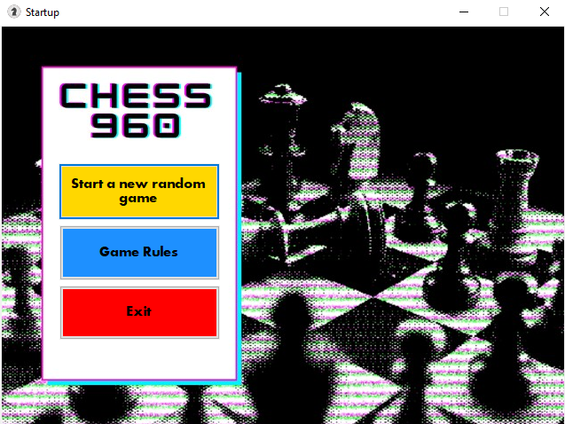
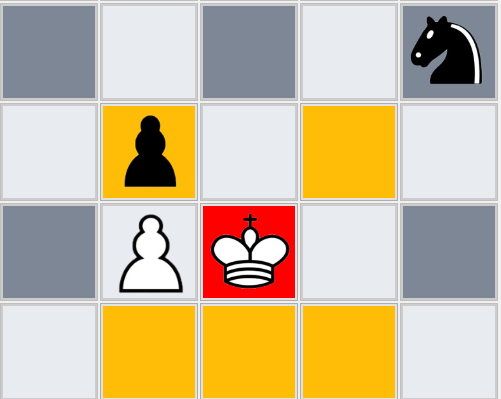
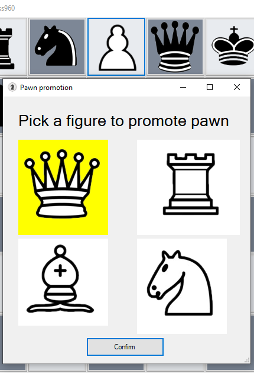

<h1>CHESS960</h1>

Windows Form Project by: Angel Petrushevski, Hristijan Saveski, Tamara Ilieva

<h1>ОПИС НА ИГРАТА</h1>

Chess960 или Fisher Random, е Шах варианта каде сите фигури на играчите случајно се распоредуваат на последните ранкови.  Играта ни е базирана на едноставна Шах варианта, каде што целта на играта е да го ставиш во Шах кралот на спротивниот играч 3 пати.

<h1>ПРАВИЛА:</h1>
<ul>
    <li>
         Има 5 видови фигури: Пиун, Топ, Ламфер, Коњ, Кралица, Крал
    </li>
    <li>
         Фугурите можат да се движат во одредена насока само ако нема друга фигура од иста боја што им го попречува патот.
    </li>
    <li>
     Фигурата може да земе фигура на спротивниот играч само ако таа фигура се наоѓа во областа на движење на фигурата
    </li>
    <li>
     Пиуните во почетна позиција можат да се движат нанапред две полиња па после само по едно. Пиуните можат да земат фигура само дијагонално.
    </li>
    <li>
     Унапредување на пиун е кога еден пиун ќе стигне до крајот на таблата, тој може да се унапреди во Кралица,Коњ,Ламфер или Топ
    </li>
    <li>
     Ламферите се фигури што се движат дијагонално по таблата во секоја насока.
    </li>
    <li>
     Коњите се фигури кои имаат Г-движење (две напред едно лево/десно) во секоја насока 
    </li>
    <li>
     Топовите се фигури кои се движат по вертикална и хоризонтална насока.
    </li>
    <li>
     Кралицата може да се движи и како ламфер и како топ.
    </li>
    <li>
     Кралот може да се движи само едно поле во секоја насока.
    </li>
    <li>
     Играта завршува кога еден играч успешно ќе го нападне кралот на противникот 3 пати.
    </li>
</ul>
<h1>ОПИС НА РЕШЕНИЕТО</h1>

Целосната логика за шаховската табла, движењата на фигурите се наоѓаат во Board.cs класата, на неа се наоѓаат блокови кои што наследуваат од Button класата, во секој block е сместена figura во која се наоѓа сликата на самата фигура, како и нејзиниот тип

За да ја опишеме шаховската табла, и да ја направиме логиката на репрезентација на секоја фигура дефинирмавме статична класа Chess.cs каде што се наоѓа 8x8 матрица од цели броеви.
Матрицата од цели броеви е основата врз која ќе се основа и имплементира играта шах. 
За да ги опишеме фигурите, користевме едноцифрени бројки кои се лесни за памтење за да може да направиме транслација од број во графичка репрезентација на една фигура.

<h4>Нумеричката репрезентација на фигурите е следна:</h4>
<h5>5 = топ</h5>
<h5>4 = коњ</h5>
<h5>3 = ламфер</h5>
<h5>2 = кралица</h5>
<h5>1 = крал</h5>

За да се може да се разликуваат двата играчи, фигурите се достапни во два типа на бои, црна и бела, за да ги разликуваме броевите на фигурите додадовме 1 напред доколку станува збор за бела фигура, а 2 напред доколку станува збор за црна фигура.

<h4>Пример:</h4>
<h5>15 = бел топ</h5>
<h5>25 = црн топ</h5>

Главната логика во оваа апликација се основа на манипулација со матрици и нумерички вредности на фигурите.

<h1>ОПИС НА ФУНКЦИИ</h1>

    За да воведеме рандомизација на фигурите искористен е фишеров алгоритам (Fisher–Yates shuffle) неговата имплементација е следна:

<pre>
    public static int [] Shuffle(int [] array)
        {
            int n = array.Length;
            while ( n > 1 )
            {
                n--;
                int k = RANDOM.Next(n + 1);
                int temp = array[k];
                array[k] = array[n];
                array[n] = temp;
            }
            return array;
        }
</pre>

    За да се води евиденција дали кралот бил таргетиран од некоја спротивна фигура се воведува функција FindInvisiblePath() која се повикува со цел да се дознае дали некоја фигура го таргетира спротивниот крал.
    За да се дознае дали кралот е таргетиран треба после поместување на соодветна фигура да се пресметаат нејзините идни позиици каде што таа би можела да се најде, доколку во некоја од нејзините идни позиици се наоѓа на местото каде што кралот се наоѓа, играта детектира закана за кралот. За сето ова да може да се имплементира во класата Chess.cs се чува специјална матрица наречена Moves во која се сместуваат идните позиици во кои фигурата може да се најде. Во неа со негативни броеви -1 и -2 се нумериираат кординатите а целта на FindInvisiblePath() e да провери дали кралот е во директен судир или закана со овие нумерички вредниости од спротивниот играч, доколку има соодветна закана, во тој случај, кралот е таргетиран и неговиот блок се бои со виолетова фигура. Играчот кој што е таргетиран мора да постави некоја фигура која што го заштитува кралот или пак да го тргне кралот од таргетираната позиција.

<pre>
    public bool FindInvisiblePath(int i, int j)
        {
            if (Chess.Map[i, j] == 0)
            {
                if (EmptyBlock(i, j) || Chess.Moves[i, j] != CurrentPlayer)
                {
                    Chess.Moves[i, j] = CurrentPlayer * -1; 
                }

                return true; // the loop can continue
            }
            if (KingWarning(i, j))
            {
                return false; // the loop can end
            }

            return false;
        }
</pre>

Оваа функција се повикува од сите фигури откако нивната позиција ќе биде сменета, во првиот услов се проверува да блокот е празен, доколку е, во мапата се евидентира можната идна позиција на фигурата, доколку не се повикува функција KingWarning(i,j) што проверува дали можеби на таа позиција се наоѓа кралот.

<h1>СЛИКИ ОД ИГРАТА</h1>

При неговите позиции кралот може да препознае дека некои од позициите претставуваат закана за кралот, и истите нема да бидат обележани како достапни за да не може играчот на тоа поле да ги постави

Промоција на пиун, доколку пиунот стигне до крајот на таблата

